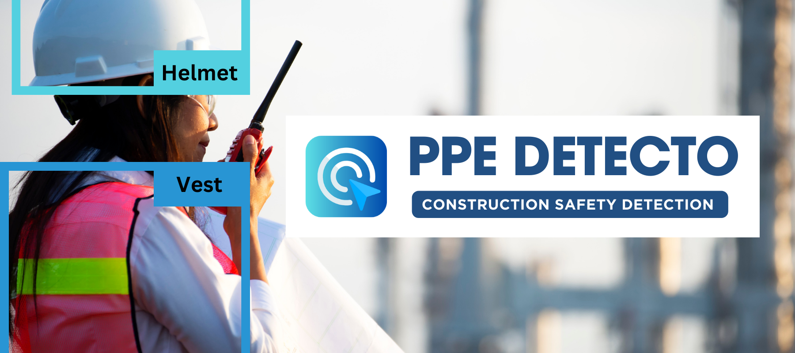

<div align="center">



# 🦺 Construction Safety Detection
### Real-time PPE monitoring with YOLOv8 + automated email alerts

[](https://www.python.org/)
[](https://github.com/ultralytics/ultralytics)
[](https://opencv.org/)
[](LICENSE)
[](https://github.com/Ansarimajid/Construction-PPE-Detection/pulls)

**Detect helmets, vests, and masks in real-time — get instant email alerts when safety violations occur.**

[Features](#-features) · [Quick Start](#-quick-start) · [Contributing](#-contributing)

</div>

---

## 🎯 Why This Project?

Construction sites are among the most hazardous work environments. Manual supervision of PPE compliance is unreliable and resource-intensive. This project automates safety monitoring using **YOLOv8**, one of the fastest and most accurate object detection models available, sending instant alerts the moment a violation is detected — before an accident happens.

---

## ✨ Features

| Feature | Description |
|---|---|
| 🪖 **Helmet Detection** | Identifies whether workers are wearing hard hats |
| 🦺 **Vest Detection** | Detects high-visibility safety vests |
| 😷 **Mask Detection** | Monitors mask compliance on site |
| 🧍 **Person Detection** | Tracks worker presence in the frame |
| 📊 **Live Counts Overlay** | Real-time sideboard showing detection counts |
| 📧 **Email Alerts** | Sends violation alerts with a captured frame every 10 seconds |
| ⚡ **Non-Blocking Alerts** | Emails sent in background — zero impact on video performance |
| 🔔 **In-Frame Notification** | On-screen popup confirms when an alert email is sent |

---

## 🚀 Quick Start

### Option 1: Conda (Recommended)

```bash
# 1. Clone the repo
git clone https://github.com/Ansarimajid/Construction-PPE-Detection.git
cd Construction-PPE-Detection

# 2. Create and activate the environment
conda env create -f yolo_env.yml
conda activate yolo

# 3. Add your YOLOv8 weights (ppe.pt) to the project directory

# 4. Run!
python webcam.py
```

### Option 2: pip

```bash
git clone https://github.com/Ansarimajid/Construction-PPE-Detection.git
cd Construction-PPE-Detection
pip install -r requirements.txt
python webcam.py
```

---

## ⚙️ Configuration

### Email Alerts Setup

Create a `.env` file in the project root:

```env
SENDER_EMAIL=your_email@gmail.com
RECEIVER_EMAIL=receiver_email@example.com
EMAIL_PASSWORD=your_app_specific_password
```

> **Gmail users:** You'll need to generate an [App Password](https://support.google.com/accounts/answer/185833?hl=en) — your regular password won't work with SMTP.

> ⚠️ **Never commit your `.env` file.** It's already in `.gitignore`, but double-check before pushing.

---

## 🧠 How It Works

```
Webcam / Video Feed
        ↓
  YOLOv8 Inference (ppe.pt)
        ↓
Bounding Box + Class Labels
   (Helmet / Vest / Mask / Person)
        ↓
 ┌──────────────────────────┐
 │  Violation Detected?     │
 │  (Person without Helmet) │
 └──────────┬───────────────┘
            │ YES
            ↓
  Background Email Thread
  (Frame attached as image)
            ↓
  Popup Notification on Feed
```

---

## 📁 Project Structure

```
Construction-PPE-Detection/
├── webcam.py            # Main detection script
├── ppe.pt               # YOLOv8 weights (add manually)
├── yolo_env.yml         # Conda environment
├── requirements.txt     # pip dependencies
├── .env                 # Email credentials (not committed)
└── Visuals/             # Demo images
```

---

## 🔧 Customization

You can tweak the following in `webcam.py`:

- **Alert interval** — default is every 10 seconds; adjust for your needs
- **Detection confidence threshold** — raise/lower sensitivity
- **Input source** — switch between webcam index or video file path
- **Email content** — customize the alert message body

---

## 🤝 Contributing

Contributions are welcome! Here's how to get started:

1. **Fork** the repository
2. **Create** a feature branch: `git checkout -b feature/your-feature`
3. **Commit** your changes: `git commit -m 'Add some feature'`
4. **Push** to the branch: `git push origin feature/your-feature`
5. **Open** a Pull Request

Ideas for contributions: multi-camera support, a web dashboard, Telegram/Slack alerts, RTSP stream support, or logging violations to a database.

---

## 📋 Requirements

- Python 3.9
- YOLOv8 / Ultralytics
- OpenCV
- python-dotenv
- smtplib (standard library)

Full list in `requirements.txt` / `yolo_env.yml`.

---

## 📜 License

This project is licensed under the **MIT License** — see the [LICENSE](LICENSE) file for details.

---

## 🙏 Acknowledgments

- [Ultralytics YOLOv8](https://github.com/ultralytics/ultralytics) for the detection backbone
- The open-source computer vision community for datasets and insights

---

<div align="center">

**⭐ If this project helped you, consider giving it a star — it helps others find it!**

</div>
